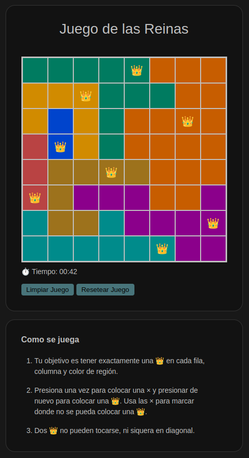

# Queens-Game

El juego es un clone de: https://www.linkedin.com/games/queens/  
  
Queens is un juego tipo puzzle que combina elementos tipicos de otros juegos como: Buscaminas, Ajedrez y/o Sudoku. Se juega en un tablero cuadriculado de 8x8 celdas, el objetivo es ubicar ocho reinas en el tablero de juego acorde a las siguientes reglas o normas de juego.

  1. Una reina por fila
  2. Una reina por columna
  3. Una reina por sección coloreada
  4. No se puede colocar dos reinas diagonalmente en celdas adyacentes

Todas estas reglas deberan satisfacerse todo el tiempo.

